# Jupyter-Python
Contains a Jupyter notebooks that implements interesting programs in Python.

## Overlapping histograms
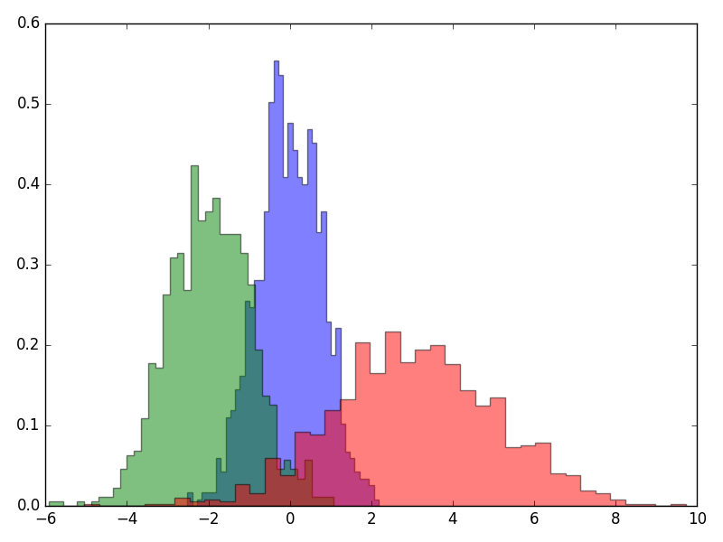

## Density plot
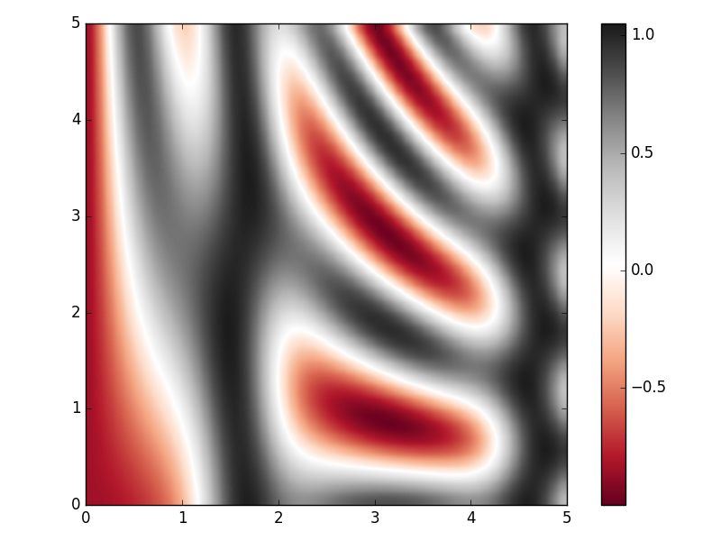

## Contour plot
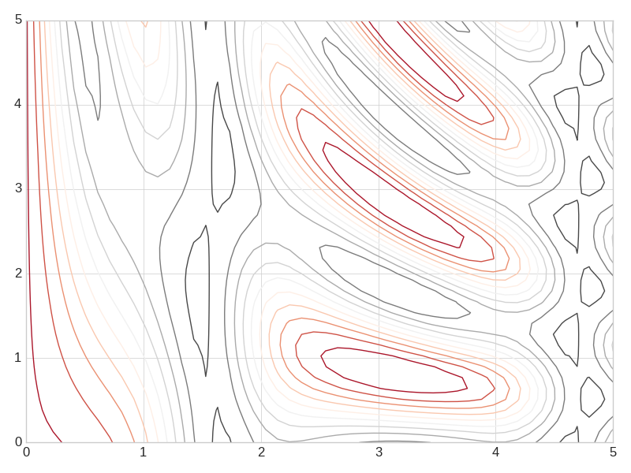

## Scatter plot in gray scale
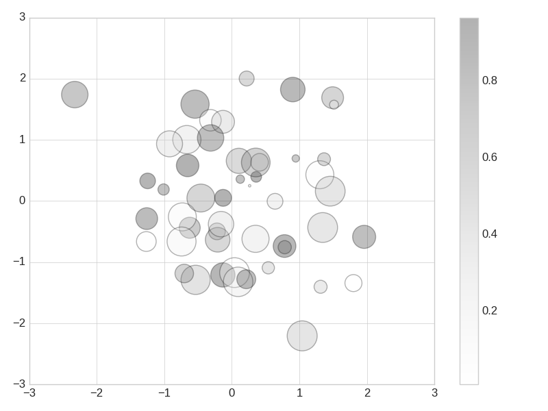

## Random walk with bounds
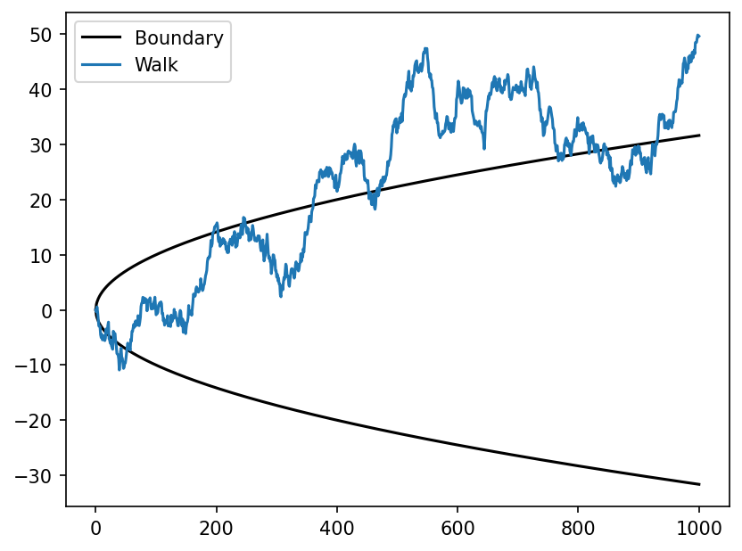

## Irregular plot grids with GridSpec
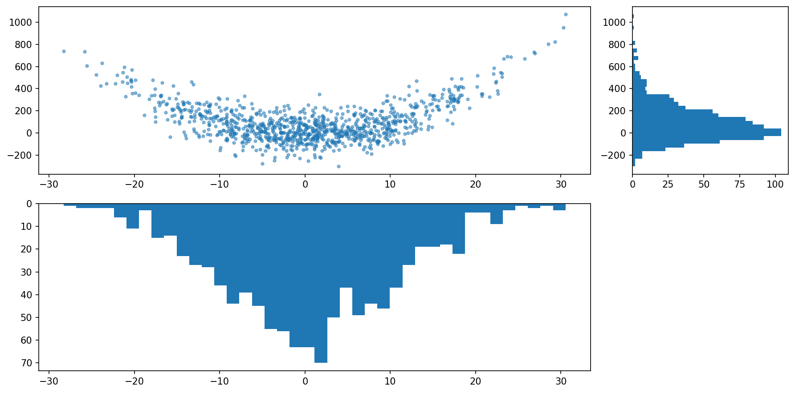

## Gantt charts
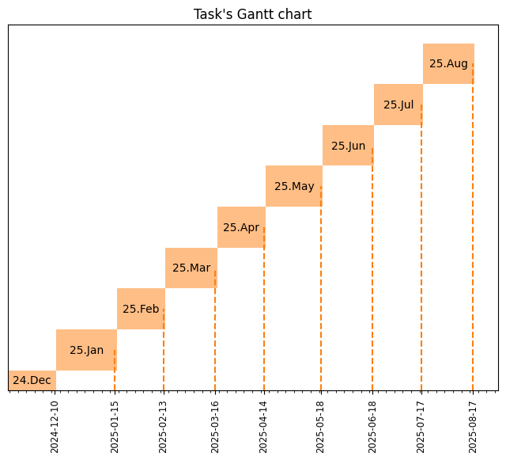
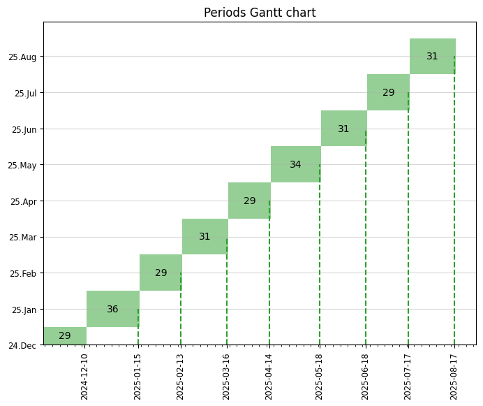

## Hours per day
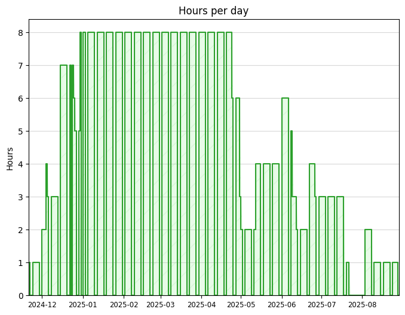
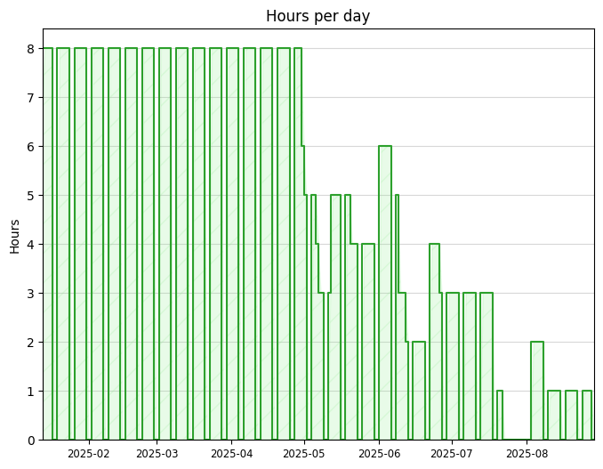

## Tasks per day
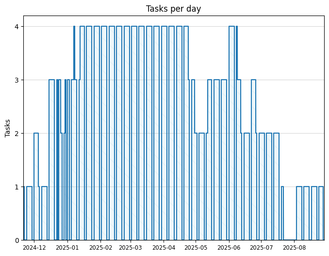
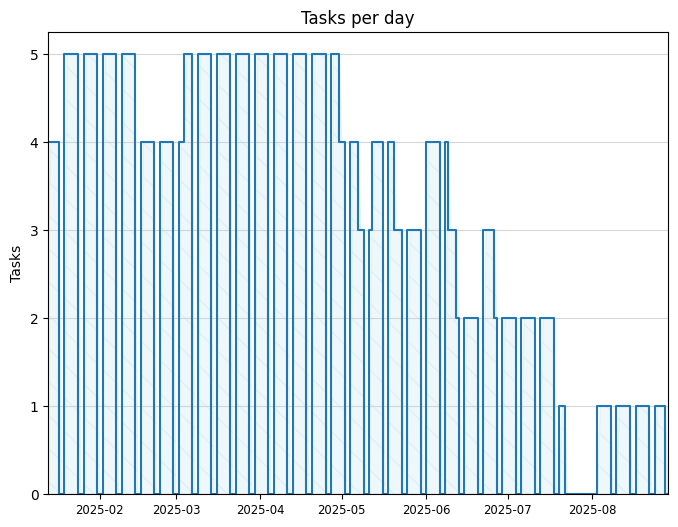

## Schedule as a cumulative bar chart
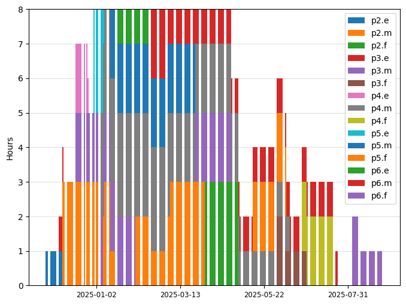
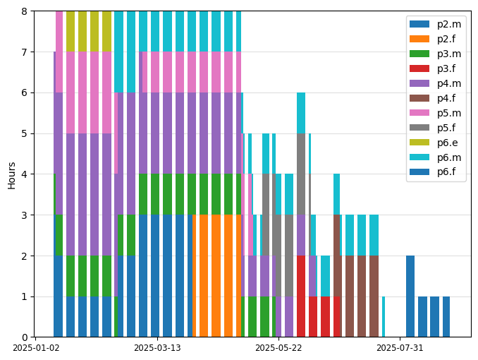

## Presentation of task boundaries

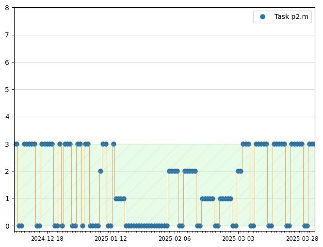
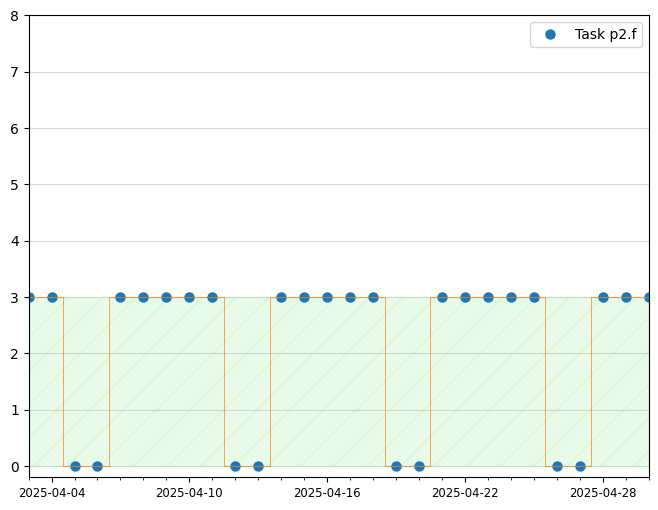

