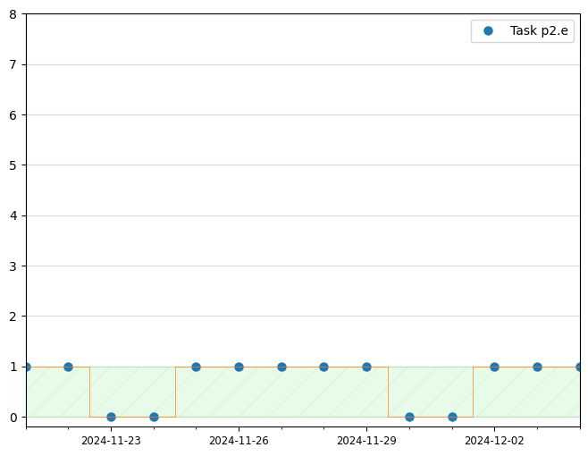

# Jupyter-Python
Contains a Jupyter notebooks that implements interesting programs in Python.

## Overlapping histograms

## Density plot

## Contour plot

## Scatter plot in gray scale

## Random walk with bounds

## Irregular plot grids with GridSpec

## Gantt charts

## Hours per day

## Tasks per day

## Schedule as a cumulative bar chart

## Presentation of task boundaries

